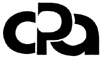

# informaticaWeb1INFOI
## Materiais utilizados e diponibilizados no primeiro semestre do curso

###  <h1> COLÉGIO PROTÁSIO ALVES</h1>

> <h2>Curso Técnico em Informática para Internet (Desenvolvimento WEB Front/Back-End)</h2>

<h3>Primeiro semestre 2021/1</h3>

<h4>Habilidades e competências:</h4>

- Desenvolvimento de textos técnicos 
- Páginas estáticas para web com HTML5 e CSS3
- Lógica de Programação com Português estruturado no Visualg
- Desenvolvimento e resolução de problemas com Linguagem C
- Sistemas Operacionais
- Conceitos de informática básica de hardware
- Conceitos de sistemas e bases numéricas
- Equipamentos de Redes de Computadores e Cabeamento Estruturado
- Endereçamento IP, Redes e Sub-redes e conceitos de Classes de IP e mascaras

